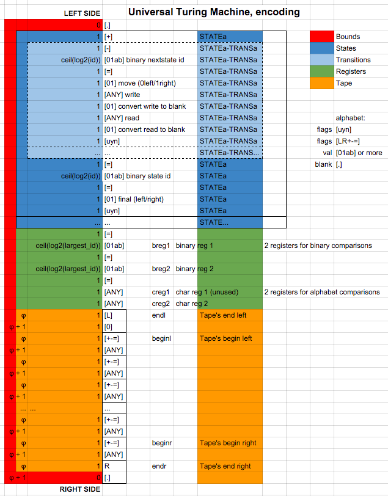

# FT_TURING, Jan 2016
>>>>> #### Deterministic Turing machine in Ocaml. (group project)

##### Grade ``(125/100)`` ``(125/125)*``
--------  -----------------------

Team: [fbuoro]() / [ngoguey](https://github.com/Ngoguey42).

<BR>

##### Goals:
- [X] Create a deterministic, single headed and single tape Turing machine(TM).
- [X] Read a TM description from a json file.
- [X] Code in OCaml or Haskell, any version, library or tools authorized.
- [X] Write 5 turing machines in json form (see below)
- [X] Write an universal turing machine(TM5) able to run TM1

##### Recommended bonus:
- [X] Compute time complexity of a given TM

##### Our work:
- [X] Deep study of theory of computation (see **Useful links** below)
<BR><BR>
- [X] Study of core/batteries-included libraries (used core/list, core/dequeue, core/array)
- [X] [Small functional wrapper (YojsonTreeMatcher.ml)](srcs/YojsonTreeMatcher.ml?ts=4) for yojson, that unfolds two recursive variants side by side with callbacks.
- [X] [Loop detection (LoopGuard.ml)](srcs/LoopGuard.ml?ts=4) when TM act as a LBA.
- [X] option (-c) to convert a json-turing-machine and its input to TM5's input format
- [X] Use of [log-log plotting (Complexity_classes.ml)](srcs/Complexity_classes.ml?ts=4#L58), [linear regression (Order.ml)](srcs/Order.ml?ts=4#L27) and gnuplot to compute time complexity of TMs. [See Below.](#0n1n_complexity)
<BR><BR>
- [X] Conception of a pseudo-asm language to describe TMs, compilable to .json format ([compiler](./compiler/))
- [X] Advanced [TM5 (utm.s)](machines/utm.s?ts=4) able to run any other TM (including itself)
- [X] [TM3 (0n1n.s)](machines/0n1n.s?ts=4) running in O(Nlog(N)) and preserving input
- [X] more TM (see below)
<BR>

<BR>

#### Mandatory Turing Machines in ./machines:
- TM0: machines/unary_sub.json  *given in subject.pdf as an example*
- TM1: machines/unary_add.s
- TM2: machines/palindrome.json
- TM3: machines/0n1n.s
- TM4: machines/zero_power_2n.json
- TM5: machines/utm.s *universal turing machine*

#### Turing Machines in ./machines optimized for complexity calculation:
- machines/abs.s  *O(1)*
- machines/unary_add_unsec.s  *O(n)*
- machines/0n1n_unsec.s  *O(nlogn)*
- machines/unary_sub_unsec.s  *O(n^2)*
- machines/is_palindrome2_unsec.s  *O(n^2)*
- machines/split_input_unsec.s  *O(n^2)*
- machines/binary_increment_unsec.s  *O(2^n)*

#### More Turing Machines in ./machines:
- machines/has_0011.s
- machines/minsky_utm.s  *1967 Minsky's universal turing machine*
- machines/split_input.s  *separate input with blanks in O(3n^2)*
- machines/is_palindrome2.s  *version 2*
- machines/binary_divisable_by3.s
- machines/zero_second_to_last.s


<BR><BR>

#### Use
```sh
# Install through brew: opam ocamlfind ocaml core.113.00.00 yojson gnuplot gnuplot-ocaml
make install_libs

# Project compilation
make

# Compile machines/*.s files to machines/*.json:
python compiler/main.py machines/*.s

# Run a json-turing-machine on a given input
./ft_turing machines/is_palindrome2.json "ABA"

# Translate a json-turing-machine and its input to a Universal-Turing-Machine input
./ft_turing -c machines/unary_sub.json "1111-1="

# Run the above input on the universal turing machine
 ./ft_turing machines/utm.json $(./ft_turing -c machines/unary_sub.json "1111-1=")

# Compute an html file through gnuplot reflecting the complexity of a given json-turing-machine
./ft_turing -O machines/0n1n_unsec.json

```

<BR><BR>

### Useful links:
##### Small presentation:
- https://www.youtube.com/watch?v=7dpFeXV_hqs

###### 18h of theory of computation (math oriented, accessible):
- https://www.youtube.com/user/hhp3/playlists

###### Linear regression:
- http://www.dummies.com/how-to/content/how-to-calculate-a-regression-line.html
- https://www.youtube.com/watch?v=w2FKXOa0HGA

###### Misc:
- http://www.wolframscience.com/nksonline/toc.html
- http://www.cba.mit.edu/events/03.11.ASE/docs/Minsky.pdf

<BR><BR>

---

```
*
- A grade of 85 was required to validate the project.
- A maximum grade of 125 was reachable.
- Second sessions are organised for failed projects.
```

---

###### unary add:
<BR>
###### is input a palindrome:
<BR>
###### is input of form 0^2n:
<BR>
###### machines/utm.s encoding (universal turing machine):
<BR>
###### 0n1n_complexity:
<BR>
###### unary\_sub\_complexity:


---
